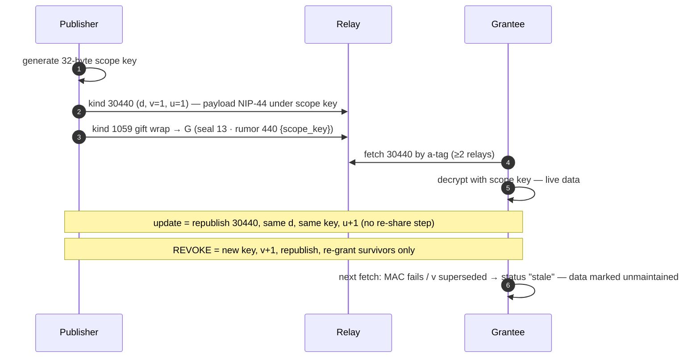

# 01 · The Protocol Layer

*Sources: `nostr-scoped-data-grants/{SPEC.md, SPEC-v2.md, SPEC-PROPOSALS.md,
DESIGN-REVIEW.md, FUTURE.md}` · `nact/docs/scoped-action-approvals.md` ·
`docs/scoped-agent-actions.md`. Kind numbers are draft placeholders pending
registry assignment (PR nostr-protocol/nips#2411).*

Everything in the estate reduces to **one primitive running in two directions**:

|  | perceive (data-in) | act (actions-out) |
|---|---|---|
| protocol | **NIP-DA / Nscope — Scoped Data Grants** | **Scoped Action Approvals** (spec name) / **Scoped Agent Actions** (umbrella) |
| mechanism | the **grant** (a key you can rotate away) | the **approval** (a signature over exact bytes) |
| runtime | NCP | Nactor |
| status | draft NIP, 2 interop-verified impls | software over existing NIPs; deliberately not yet a NIP |

## 1 · Standard nostr machinery this all rides on

| NIP | Used for |
|---|---|
| NIP-01 | event shape; addressable-event replacement (highest `created_at`, tie → lowest `id`) — load-bearing for rotation and multi-device |
| NIP-44 v2 | all payload encryption (scope keys used directly as `conversation_key`, skipping ECDH — zero new cryptography) |
| NIP-59 | gift wrap (seal kind 13 + wrap kind 1059, ephemeral wrap keys, timestamps fuzzed ≤2 days back) — all grant delivery |
| NIP-46 | remote signing (kind 24133) — the bunker; scoped per-connection |
| NIP-98 | signed HTTP auth (kind 27235) — every Nactor API call |
| NIP-40 | expirations on grants and proposals |
| NIP-65 / NIP-89 | relay lists (10002) + handler adverts (31990) — "address the runtime by identity, not URL" (AD-2) |
| NIP-05 | human-readable identity (`nactor@nave.pub`, `jaf-quill@dequalsf.com`, …) |

## 2 · NIP-DA — Scoped Data Grants (the perceive side)

**The inversion:** nobody maintains contact data about anyone else. Each person
keeps one encrypted authoritative record on relays and grants scoped access to
specific keyholders. The address book becomes an *emergent view* — a set of
capabilities (pointer + decryption right) that always dereference to current
data. N self-maintained records instead of N² rotting copies.

### The kinds

| kind | event | notes |
|---|---|---|
| **30440** | Scoped Data Set (addressable) | NIP-44 under a random 32-byte **scope key**; tags `d` (opaque scope id — never semantic), `v` (key-rotation generation), `u` (strictly-increasing content sequence, rollback-detectable without decrypting) |
| **440** | Data Grant | **unsigned rumor**, NIP-59 sealed+wrapped to the grantee; content `{scope_key, scope_name}` (+ the `nvoy` terms object); `a`-tag points at `30440:<publisher>:<scope-id>`; deniable if leaked, authenticated by the seal |
| **441** | Revocation notice | optional, gift-wrapped courtesy; revocation itself is the rotation |
| **10440** | Grant Index | replaceable, NIP-44-encrypted **to self**: `issued` (rotation records), `received` (= your private address book), `inbox` cursor. The whole graph recovers from the nsec alone |
| 31440 / 442 | v2 attenuable scope / grant | experimental parallel track (§4) |

The full lifecycle in the primitive's own words (the spec repo's landing page):

```
publish  30440   encrypt your record under a fresh scope key
grant    440     gift-wrap that key to each keyholder
update   30440   re-encrypt + republish — everyone sees it live
revoke   30440   rotate the key, re-grant the rest — the ex-grantee is out
recover  10440   rebuild the entire graph from one key on paper
```



**Revocation = key rotation**, cost O(remaining grantees). Deletion is rotation's
special case: a final empty 30440 under a never-granted key (replacement *is*
destruction on conforming relays). **Honesty rule, stated everywhere:** rotation
controls *future* access only — a revoked grantee keeps plaintext already seen.
"Stop sharing updates," never "un-share."

**Reader status enum:** `missing | rollback | stale | ok` (v2 adds `locked`).

**The `nvoy` terms extension** (`purpose`, `expires_at`, `no_persist`,
`redelegate`, `auto_relinquish`, …): **terms are compliance, not cryptography.**
Only encryption, the hidden delegation graph, and rotation are cryptographic —
"the delegator's real lever is rotation."

### The P-series hardening (all landed 2026-07-22, one linear PR — spec repo #17)

Six externally-reviewed weaknesses, each paid down in the spec:

| P | Fix | The one-line mechanism |
|---|---|---|
| **P1** | Grant-author verification | authenticated grant author = the **seal pubkey**; must equal the `a`-tag publisher, else it's a re-wrap (indistinguishable from key exfiltration) — reject by default |
| **P2** | Anti-rollback | the `u` tag + per-scope `(v,u)` high-water mark; fetch ≥2 relays; lower = rollback signal (detection, not prevention) |
| **P3** | Multi-device consistency | Lamport `v` (max-observed+1), NIP-01 deterministic winner, **mergeable** (not last-writer-wins) Grant Index with `mtime` + tombstones + reconciling re-grants |
| **P4** | Incremental inbox | Grant Index as warm cache; `since` scans must reach back the **2-day** NIP-59 backdating window; dedupe by wrap id |
| **P5** | Attenuation | per-field key trees → the v2 track (§4) |
| **P6** | Metadata hardening | rotate `d` at key rotation (severs history for a revoked watcher), restart `u`, fetch jitter, read-relay separation, size padding (`pad`), decoy updates. Disclosed limit: raises observer cost, does not buy unobservability |

### Reference implementations & interop

JS library (`nipxx.mjs`, isomorphic, ~200 LoC core) + Go CLI sharing nothing but
the spec. Live interop: **9 scenarios** on public relays (cross-implementation
publish/grant/dereference, rotation detection, index recovery, incremental
catch-up, `d`-move follow, device-collision convergence, tombstone
non-resurrection). Adversarial-observer assertion in every suite: a hostile
relay sees only kinds **30440 / 1059 / 10440**.

## 3 · FUTURE directions already prototyped

- **A request that is a grant *and* an enact:** the requester grants the
  provider scoped access to the request itself; the provider's approval is a
  signature authorizing assemble-and-return; the response is *another scope*
  (the provider revokes what it returned by rotating). Perceive and act become
  one exchange, two directions. Worked instance: Nact's channel-authority
  grants.
- **Delegation chains — the split that governs everything downstream**
  (proven in `nvoy/test/regrant.mjs`, the "Quill linchpin"):
  - **Key re-wrap** — cryptographic cascade (one root rotation strands every
    holder) but **no attenuation** and indistinguishable from exfiltration →
    **rejected** by conforming receivers (P1).
  - **Derived-scope sub-grant** — the sub-issuer publishes its *own* 30440 with
    a **narrowed** payload → real attenuation, per-leaf revocation; cascade is
    **runtime-mediated** (the sub-issuer *must* rotate its derived scopes when
    its source goes stale — a conformance obligation, staleness bounded by its
    sweep interval + leaf TTLs).

## 4 · The v2 track — per-field attenuation (kinds 31440 / 442)

One root key `K`; everything derives via domain-separated HKDF-Expand:
`K_f(g) = HKDF(K, "nipda/v2/field:"‖f‖":"‖g)`, a manifest key `K_m`, and
16-hex opaque wire **labels** per field (field names never relay-visible; every
label changes on root rotation). A grant is either **full** (`root_key`) or
**attenuated** (`manifest_key` + per-field subkeys) — a grant can be strictly
narrower than what the granter holds, **enforced by math, not client policy**.
Rotate the smallest thing that cuts off the party being revoked: per-field
rotation costs O(that field's attenuated holders); root holders ride through
grant-free. Separate grant kind 442 exists so v1 readers structurally skip v2
grants (a versioned 440 payload would crash them). Status: experimental,
JS-only, deliberately independent library (`nipxx-v2.mjs`).

## 5 · Scoped Action Approvals — the act side (protocol view)

*Full treatment: [03-delegated-actions.md](03-delegated-actions.md). Status:
exploratory — "not a spec and not a NIP," by design (build-first; the Nscope
playbook: two implementations, then the PR).*

Two events, both NIP-59 gift-wrapped, inner kinds deliberately TBD:

1. **Action Proposal**: content = the **unsigned event template** to be enacted;
   tags `p` (approver), `act` (acting identity), `k` (target kind = the scope),
   `expiration` (NIP-40), `context` (rationale shown to the human, never
   broadcast).
2. **Approval Response**: `["e", <proposal-id>]` + `["verb","approve"|"reject"]`
   — signed by the approver, bound to one proposal id, unreplayable onto a
   different action.

**The one standardizable atom** — the provenance tag on the enacted event:

```
["approval", "<approval-event-id>", "<approver-pubkey>"]
```

public, checkable proof that an agent action passed a human tap, and whose.
Approval is **decoupled from signature**: the approval says yes; the acting
identity's key (custodial or NIP-46 bunker) still does the signing.

**Positioning** (Director's calls, 2026-07-23): be generic in the runtime,
specific on the wire. Nostr already ran the generic experiments and deprecated
both — NIP-90 (DVM marketplace: "got totally out of control") and NIP-26
(delegated signing: broad delegation ≈ handing over the root key). This model
fixes NIP-26's flaw: the delegate **proposes**; it can never sign as you.

## 6 · What the protocol honestly cannot do

- Rotation is forward-only — seen plaintext stays seen.
- Terms (`no_persist`, `redelegate`) are compliance, not cryptography.
- P2/P6 make rollback and correlation *detectable/expensive*, not impossible;
  "the rotation moment itself is loud."
- Derived-scope cascade is bounded by sub-issuer compliance, not math.
- Sealed-box anonymity (warm.contact `wc1`) means no sender authenticity —
  adjudicated by approval gates, not crypto.
