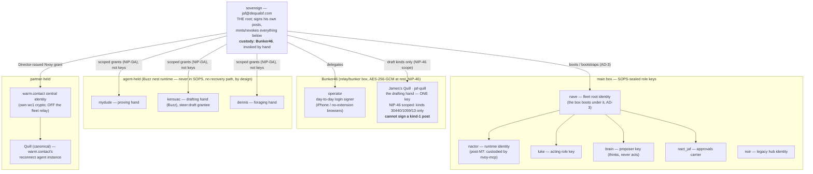

# 02 · Identities & Signing — who signs what, with which key, held where

*Sources: `docs/IDENTITY-REGISTRY.md` (the roster of record) ·
`nact/docs/{architecture,credential-sovereignty}.md` · `docs/quill.md` §9 ·
`docs/sovereign-signing.md` · `deploy/relay/allowlist.json` ·
`deploy/bunker/README.md`. Registry rows, not this file, are canonical for
npubs.*

## 1 · The shape: one human root, everything chains up

**The Director** = the human root authority, ecosystem-wide (AD-8). For the
fleet that is James (`jaf@dequalsf.com`, the **sovereign** key). For a
warm.contact user's Quill estate, that user is the Director of their own chain.
(Noir's AI game master is always "Noir's Director" — a different thing.)

What the Director holds over agent-held and partner-held keys is **never the
key** — it is the scoped grants issued to those npubs; rotating a scope revokes
one without touching the identity.

## 2 · Custody classes

| Class | Holds | Recovery | Notes |
|---|---|---|---|
| **Bunker46** (`bunker.nave.pub`) | sovereign, operator, **jaf-quill** (imported 2026-07-24) | `.env` `ENCRYPTION_KEY` + key store → Bitwarden; jaf-quill nsec also escrowed in Bitwarden | signs over NIP-46 (kind 24133); per-connection **kind scoping** + WebAuthn 2FA; always-on signer = always-on attack surface, hence delegated/scoped keys only for automation |
| **SOPS** (`deploy/secrets/nave.enc.env`, age) | fleet role nsecs (nave, luke, brain, nact_jaf, noir) | age key on the Mac (`~/.config/sops/age/keys.txt`) + Bitwarden | decrypted to box env at deploy; sanctioned box-resident secrets are exactly **the age key + NACTOR_NSEC** — and post-M7 the nactor key moved to nvoy-mcp (`NVOY_NSEC`), so the runtime env holds **no nsec** |
| **Agent-held** | mydude, kerouac, dennis | none — re-mint, that's the point | minted by Buzz Desktop; publish their own kind-0/10002; **not** on the fleet relay allowlist |
| **Partner-held** | warm.contact central id, canonical Quill | partner's own custody | canonical Quill's sealed env lives with deploy secrets, **never** in the app repo (pattern-based ignore: `*.nave.env*`, `*.npub.txt`) |
| **Director-device** | the Director's signer for approvals/steering (NIP-07 / NIP-46) | — | never on any box |

## 3 · The three-keypair pattern (grant → receive → act)

Every Nactor deployment separates authority into three jobs
(`nact/docs/architecture.md`):

| keypair | lives | job | verb |
|---|---|---|---|
| **Director(s)** | their device — never the box | sign config scopes, credential grants, **and the approvals** | grant |
| **runtime** (nactor) | custodied by nvoy-mcp (post-M7) | decrypt what a Director grants it | receive |
| **roles** (luke, nave) | on the box, SOPS-sealed | sign the actual broadcasts | act |

Credential sovereignty (AD-6 + `credential-sovereignty.md`): **config is granted
to the runtime; credentials are granted to the identity.** The box verifies, it
does not decide; blast radius = one identity. "A secret is migrated when its
only durable home is a Director-signed scoped grant" — true for all 8 live
credentials since 2026-07-21 (M-series closed).

## 4 · THE MATRIX — who signs what

| Artifact | Signed by | Key custody | Path |
|---|---|---|---|
| **The Director's published posts (kind 1)** | **the sovereign key, in his own hand** | Bunker46, invoked by hand via his signer in Ngage | the director path — drafts arrive as `draft:post/*` grants only his npub can read (AD-10) |
| Posts as **luke** / **nave** (kind 1) | the role key, after the Director's tap | SOPS on box | box path: brain proposes → Telegram/web approve → Nactor signs + broadcasts (carries `["approval", …]` provenance) |
| `draft:post/*` scope (30440) + grant (440), from the scribe / Mac drafter | **jaf-quill** | **Bunker46 only** — NIP-46 connection scoped to kinds 30440/1059/13; **cannot** sign kind 1 | luke#25–27, warm.contact#48/#49; box raw-key path retired 2026-07-24 (break-glass `SCRIBE_ALLOW_BOX=1`) |
| `draft:post/*` for keyless director-path identities (Nact pipeline) | **Nactor's own key** — "the box signs as itself, never as the keyless identity" | nvoy-mcp | `nact/nactor/ngage-delivery.mjs`; withdraw = kind-5 tombstone |
| **Pen attestation** (kind 24140, inside the encrypted scope) | the drafting identity's own key | wherever that pen lives | nact#44 / ngage#11: "nothing reaches the desk that didn't come from the identity's pen" — desk recomputes the hash before trusting the sig |
| `steer:draft` steering grants | **the Director** | his signer (NIP-07/NIP-46) | Ngage → gift-wrapped to each pen; republish = rotate; mirrored into the kind-10440 Grant Index so Nvoy stays source of truth |
| Config (`PUT /api/config`), credential grants, `channel:bind` grants | **the Director** | his device | the owner cannot manufacture Director authority (threat-model §channel-binding) |
| Approvals (box path) | the Director — NIP-98 (web) / bound Telegram tap / signed NIP-59 reply | his device | bound by the channel-authority grant; critical tier ⇒ sign-on-device only |
| Nactor API calls (`/api/broker`, connectors) | the calling identity, NIP-98 (kind 27235) — e.g. **brain** for anthropic | on-box role keys | verbs structural; egress pinned by the credential |
| `/api/proxy` engine egress | **nothing signs** — dummy `NACT_PROXY_TOKEN`, internal network only | — | real key injected from RAM; public vhost must refuse `/api/proxy/*` |
| Endpoint adverts (10002 + 31990) | **nactor** | nvoy-mcp | AD-2: moving the box = republish |
| Interactive app sign-in (NIP-98 challenges) | NIP-07 extension, or **operator** via bunker (iPhone) | extension / Bunker46 | `nave-connect`, one module fleet-wide (AD-11) |
| Buzz-nest kind-0 / 10002 | each agent's own key | agent runtime | box `publish-profiles.mjs` deliberately cannot |
| warm.contact Quill drafts (Mac) | **jaf-quill via bunker** (PR #49) or interim Keychain | Bunker46 / Keychain (retiring) | `warm quill-draft`; Anthropic via `credential:anthropic` grant-to-app — prompt never touches Nave |

**The asymmetry worth remembering:** on the *box* path signer ≠ approver, so the
enacted event carries the `["approval", <id>, <approver>]` tag as public proof.
On the *director* path the Director is both approver and signer — **his
signature is the enactment**; no tag needed.

## 5 · The relay's view of identity (`deploy/relay/allowlist.json`)

`relay.nave.pub` (strfry + write-policy plugin) accepts:

- **author ∈ the 8 fleet keys** (nave, luke, brain, nactor, nact_jaf, noir,
  sovereign, operator) — all kinds;
- **kind 24133** from anyone (NIP-46 transport — E2E-encrypted; the bunker
  itself authorizes; ephemeral client keys can't be allowlisted in advance);
- **kind 1059 by recipient** (`recipientKinds`, nave.pub#37, shipped
  2026-07-23): gift wraps are *authored* by single-use ephemeral keys by design,
  so wraps are admitted when a `p` tag names a fleet key — this is what lets the
  whole grant plane (draft grants, steering, credentials) ride the sovereign
  relay;
- everything else rejected. Partners (warm.contact) and the Buzz nest are
  deliberately **off** this list — public relays are their lane.

## 6 · Conventions at identity birth

Fleet identity: mint key → hex into `allowlist.json` → nsec into SOPS →
Bitwarden secure note → row in `IDENTITY-REGISTRY.md`. Agent-held identities
skip SOPS/Bitwarden *on purpose* (custody is the runtime; loss = re-mint).
Never an nsec in a repo, chat, or artifact; boxes by role, never IP.
