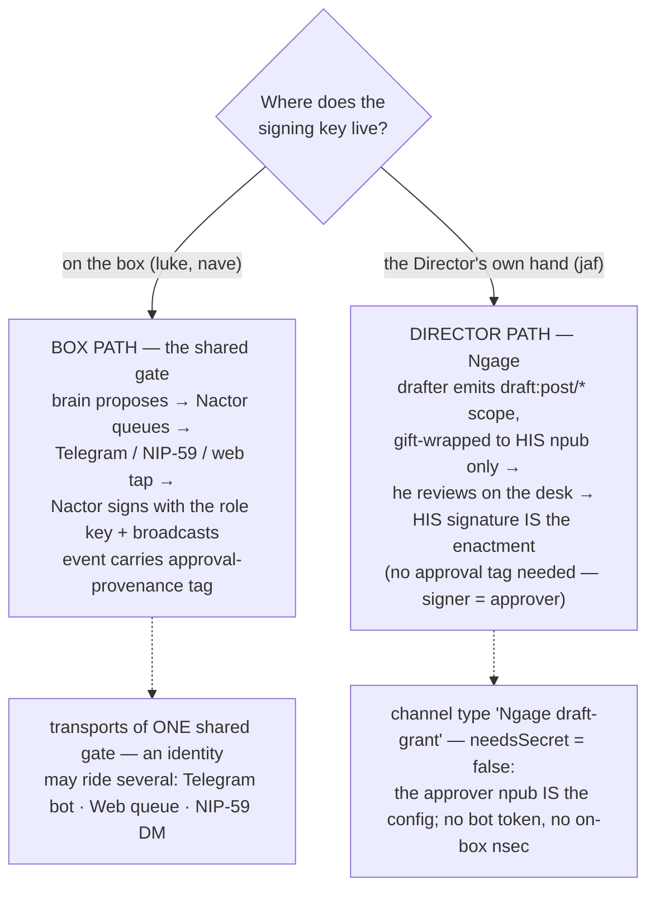

# 03 · Delegated Actions — the act side, and the July 22–25 work

*Sources: `docs/scoped-agent-actions.md` (the microstandard, 2026-07-23) ·
`nact/docs/{scoped-action-approvals,threat-model}.md` · `nact/lib/routing.mjs` +
`nact/nactor/ngage-delivery.mjs` · `docs/quill.md` §9 · `luke/jaf-scribe.mjs` ·
`warm.contact` PR #49 · `deploy/ops/run-scribe.sh` ·
`.github/workflows/scribe-cron.yml`.*

## 1 · The reframe

We do not want *remote drafting*. We want **remote action**: ask an agent,
anywhere, to do a scoped thing on my behalf; have it come back as a proposal
only I can authorize; enact it under my signature. **Drafting is one actuator.**
Posting is another; `exec` on a box (Nops) another; a PR, a scoped email, a
booking — the same spine with the actuator swapped at the end.

```mermaid
sequenceDiagram
    autonumber
    participant D as Director
    participant A as Actuator (agent)
    participant K as Signing key

    D->>A: REQUEST — a scoped grant, gift-wrapped:<br/>"act as actuator A, scope S, budget B, until T"
    A->>D: PROPOSE — an unsigned template:<br/>the EXACT artifact that would be enacted
    D->>D: APPROVE — reviews the faithful render,<br/>signs THIS template (WYSIWYS)
    K->>K: ENACT — the authorized key signs;<br/>artifact carries ["approval", id, approver]
    Note over A,K: the actuator NEVER holds the signing key for the final artifact
```

**Why this is the corrected NIP-26:** NIP-26 let a delegate *sign as you* and
was deprecated for it. Here the delegate only proposes; "the drafting key cannot
post; only the Director can approve — enforced by encryption, not policy."
NIP-90's lesson (generic marketplaces get out of control) sets the posture:
**generic in the runtime, specific on the wire** — one actuator interface
internally, narrow per-use-case semantics publicly, and a NIP only if
cross-client demand appears (the Nscope playbook).

**The frame: NCP is our MCP.** NCP supplies MCP's two primitives from the nostr
grant graph — *resources* = NIP-DA data grants (perceive), *tools* = Scoped
Agent Actions (act) — with the grant signature as the authorization (no OAuth,
no bearer token), gift-wrap on the wire, and a human tap on every verb. The
divergence from MCP's OAuth 2.1 auth spec is deliberate; the capability model
*is* the sovereignty argument.

## 2 · The two approval paths (AD-10) — the doctrine that reorganized everything

**Every identity binds to exactly ONE approval path, forced by where its signing
key lives — derived from custody, never chosen by preference**
(`nact/lib/routing.mjs`; a wrong-path wiring click is *refused* with the custody
reason).



This dissolved the overloaded-agent condition: Luke had been drafting as
*himself* (box path) and *for James* (who signs in his own hand) on one route.
Drafting-for-the-Director is now **Quill's job** (AD-10, quill.md §9); Luke's
charter already said "never speak as him or post for him."

**A third transport state — `ungoverned` (AD-12).** A path has two values and a
transport has three, not two. Beyond *wired* and *not wired* there is a transport the
control plane **displays but the runtime does not consume** — today, the Telegram
approval lane, where Nactor's only approval adapter is the web queue. The routing
board is already honest about it in prose ("wiring this cell records intent, but
changes nothing at runtime"), and AD-12 gives it a name so it cannot regress into
rendering as wired. The rule: **a transport with no consumer is `ungoverned`, and a
surface may never present it as an approval route.** This is nact#46 made
unrepresentable rather than merely corrected.

Note for readers coming from the `nact` repo: AD-10 is implemented there
(`lib/routing.mjs`, `lib/routing.test.mjs`) but documented only *here*. The code is
the better guide to the mechanics; this section is the better guide to why.

## 3 · The director path, end to end (the shipped pipeline)

```mermaid
sequenceDiagram
    autonumber
    participant S as Drafter (Mac `warm quill-draft` / box bunker-mode scribe)
    participant B as Bunker46 (holds jaf-quill key)
    participant R as Relays
    participant G as Ngage desk (Director's browser)
    participant J as The Director's signer (sovereign key)

    Note over S: reads brief/jaf.md + live steer:draft grant<br/>(grant augments the file and wins on conflict;<br/>only Director-authored steering honored)
    Note over S: evidence: 26h of GitHub + Substack + nostr context
    S->>S: compose via credential:anthropic grant-to-app<br/>(prompt never touches Nave infra)
    S->>B: NIP-46 sign requests — scoped to kinds 30440/1059/13
    B-->>S: signatures (the key never leaves the bunker)
    S->>R: 30440 scope "draft:post/<id8>" (fresh key)<br/>+ 440 grant in a 1059 wrap → Director's npub
    G->>R: fetch wraps addressed to him
    G->>G: FOUR GATES: verified unwrap → draft: namespace →<br/>first-hand (author = publisher) → pen allowlist
    G->>G: PEN RULE: render only from bytes the pen signed<br/>(recompute hash — no signature reuse)
    J->>J: Director signs the kind-1 IN HIS OWN HAND
    J->>R: publish — his signature is the enactment
    Note over G,S: steering returns the same wire:<br/>steer:draft grant to the pens; republish = rotate
    Note over S: withdraw = rotate/tombstone the scope → desk shows "withdrawn by agent"
```

Gate details (ngage `drafts.mjs`): the desk does its own gift unwrap
(nostr-tools' `unwrapEvent` skips seal verification, so it isn't used), enforces
`rumor.pubkey === seal.pubkey`, rejects re-wrapped grants outright, and
fail-closes on an empty pen allowlist. Two trust roles, structurally disjoint:
**pens** (drafting hands — admitted *and* steered) vs **deliverers**
(coordinators like the Nactor — admitted, **never** steered; listing the Nactor
as a pen would deliver steering to a box-custodied key, ngage#9).

## 4 · The action-grant scope schema (workstream B — freeze candidate)

The **standing authorization** for a class of actions (NWC's connection ↔
request split, generalized). A `capability:<actuator>` NIP-DA scope,
gift-wrapped to the agent's npub, revocable by rotation:

```jsonc
{
  "cap": "draft",                    // actuator: draft | publish | exec | connector:mail | …
  "verbs": ["reply", "post", "pr"],  // allow-list within it (verbs are STRUCTURAL — an
                                     // actuator exposes only what it implements)
  "pin": { "surface": ["reconnect","post"], "approver": "<jaf-npub>" },
                                     // the GRANT fixes the target, never the request body;
                                     // pin.approver is the whole security of the director path
  "budget": { "max": 20, "per": "daily" },  // rate cap (unmetered) or spend cap (metered)
  "expires": 1793000000,             // NIP-40 — ALWAYS time-boxed (the NIP-26 lesson)
  "tier": "normal"                   // risk tier; "critical" ⇒ no one-tap approval
}
```

**Attenuation:** a grantee may issue a sub-grant only with `verbs ⊆ parent`,
`budget ≤ parent`, `expires ≤ parent`, `pin` narrowed never widened; root
rotation cascades (biscuit/macaroon attenuation as a NIP-DA re-grant — POLA by
construction). Only the **handshake + provenance tag** are NIP candidates; the
schema stays app-interim (AD-8) until cross-client demand exists.

## 5 · Threat model for plural actuators (workstream C)

**WYSIWYS is actuator-specific.** "Render the action, freeze it, bind approval
to its hash" is only automatic for nostr events (the NIP-01 id). Each actuator
must define its own faithful render + fingerprint — **an actuator without one
cannot be granted**, and no actuator reuses another's hash:

| actuator | faithful render must show | fingerprint |
|---|---|---|
| `publish` | kind + all tags + hidden/bidi-char flags | NIP-01 event id |
| `exec` (Nops) | the exact argv, injection flags | sha256(argv) |
| `connector:*` | verb, pinned host/mailbox, read-only-ness | sha256({verb,params,pin}) |
| `draft` / `pr` | exact text, target, that it is a draft | sha256(rendered artifact) |

Plus: **confused deputy / egress repoint** (a template naming a different
host/branch than the grant's `pin` is refused); **cross-actuator approval
replay** (proposals commit to `{cap, verbs, fingerprint}` so a draft-approval
can't authorize an exec); **gift-wrap the request, not just the reply** (the
request says what you're about to do — ContextVM defaults to plaintext, our
invariant is `encryptionMode: REQUIRED`); **the autonomous-execution footgun**
(an actuator is *structurally incapable of enacting* — it holds no
signing/enact capability; the gate is a property of the code); **risk tiers**
(`nact/lib/tiers.mjs`): low = one-tap · elevated = approve after full tags shown
· critical (kind 0/3/5/10002, key rotation, grant issuance) = **sign-on-device
only**, unknown tier treated as elevated, never downgraded.

Approver-binding completes it: a config entry `(npub, channel)` is two
identifiers with no cryptographic relationship — Director authority must anchor
in the key, so out-of-band channels (Telegram) require a signed binding ceremony
(fresh nonce over the channel, signed statement *naming* the channel), stored as
a **channel-authority grant** dereferenced live on every approval; nostr-native
channels are intrinsically bound. Unbound = deliver-but-don't-honor.

## 6 · Custody — the resolution that closed the week (2026-07-24)

quill.md §9 had proposed *per-device keys* one line after "one identity, one
key" — a contradiction that cost a session. Resolved following the pattern
already blessed for the sovereign key:

> **One jaf-quill key. It lives only in Bunker46 — sole custody and arbiter.
> Every drafter (Mac, box, any future host) borrows signatures over a scoped
> NIP-46 connection (draft kinds 30440/1059/13 only, no kind-1). No drafter
> holds the key; no key is ever copied.**

Why the pivot from Keychain-local: a Mac Keychain key is extractable by
user-level malware, and an always-on box drafter would otherwise need the key on
shared infra (the AD-10 objection). The bunker gives best-available at-rest
custody, per-connection revocation per drafter, rotation as the identity-level
kill. Accepted trade: drafters must reach the bunker (no offline signing);
bunker `.env`/store must be backed up; the nsec is escrowed in Bitwarden.
AD-10 unchanged: the *published post* is still the sovereign key, by hand.

## 7 · Timeline — what actually shipped, July 22–25

| Date | What | Where |
|---|---|---|
| 07-22 | **Ngage live** — first sovereign post signed; steering round-trip proven; AD-10 recorded | ngage, AD log |
| 07-22 | Voice doctrine (AD-9): per-identity, structurally isolated, evidence-only | luke#15, `voices.mjs` |
| 07-23 | **Scoped Agent Actions** doc: NCP framing, ContextVM spike (adopt-with-wrapper: scoping + gift-wrap native, human gate ours, NIP-46 adapter needed), action-grant schema drafted, threat model, interop verdict (**align with HDP / A2A #1404, don't invent** — our novel edge is *public, relay-anchored, third-party-checkable* approval provenance) | `docs/scoped-agent-actions.md` |
| 07-23 | Ngage becomes a first-class channel type; routing derived from key custody | nact#31, `lib/routing.mjs` |
| 07-23 | Relay admits gift wraps by recipient → the grant plane rides the sovereign relay | nave.pub#37 / PR #54 |
| 07-23 | canonical-quill identity minted; pattern-based identity-file ignore rules | warm.contact |
| 07-24 | **Mac drafting first light**: `warm quill-draft` — steering + evidence + `credential:anthropic` grant-to-app → `nvoy_draft_publish`, pen-direct | warm.contact#43 |
| 07-24 | **Pen-verified desk**: kind-24140 attestation; desk recomputes hash; unpenned renders inert | nact#44 / ngage#11 / ngage PR #12 |
| 07-24 | **Custody resolution** (§6): one jaf-quill key, Bunker46 only; registry updated | quill.md §9 (#75), registry (#76) |
| 07-24 | **Bunker-signer modes** shipped both drafters — hand-rolled NIP-46 client (stable transport key, nip44 both ways, single-filter subscribe — three wire-proven Bunker46 lessons) | luke#25–27, warm.contact#48/#49, nvoy#30/#33 |
| 07-24 | Box raw-key scribe **retired to break-glass** (`SCRIBE_ALLOW_BOX=1`); bunker-mode branch is the sanctioned always-on drafter | `deploy/ops/run-scribe.sh` (#70, #74) |
| 07-24 | **Cadence installed**: cron `0 13,17,23 UTC` (9a/1p/7p ET), `MAX_DRAFTS=2` → ≤6 offers/day on the desk; UTC because this box's cron ignores `CRON_TZ` | `scribe-cron.yml` (#77, #78) |

**Net effect:** the Director's drafting pipeline now satisfies its own threat
model — the drafting key is off every drafting host, scoped so it cannot post,
each draft is pen-attested, and nothing publishes without the sovereign
signature. The generic-actuator design work (schema freeze, actuator interface
in Nactor, two implementations → then engage HDP/#1404) is the queued frontier.
