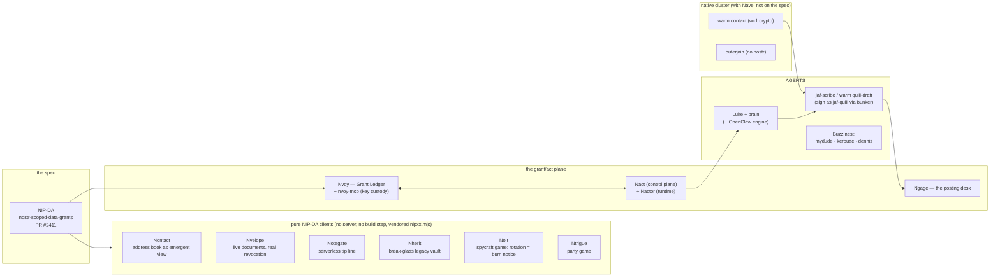

# 04 · Apps & Runtimes

*Sources: `docs/PROJECTS.md` (registry of record) · `docs/INVENTORY.md` ·
`nact/docs/{architecture,connectors,ncp}.md` · `nvoy`, `ngage`, `luke`,
`warm.contact` READMEs and source.*

## 1 · The map

Full status per project: `docs/PROJECTS.md`. The one-line identities:
**Nvoy** = what your agent may *see*, and un-see (the Ledger is the source of
truth for **all** grants — even Ngage mirrors its steering grants into Nvoy's
kind-10440 index). **Nact/Nactor** = what your agent may *do*, behind the human
tap. **Ngage** = the reversed arrow (agent grants drafts *to* the human).

## 2 · Nactor — the act-side runtime

One `nact` library, two deployables: the **app** (static control plane, holds no
keys) and the **Nactor** (per-box runtime: proposal queue, role keys, pluggable
actuator — `publish` for Nact, `exec` for Nops, `connector` for third-party
accounts). "Nactor" is a *role*: there is no such thing as "the" Nactor.

- **API** (all NIP-98-gated except `/api/health`): `state · propose · enact ·
  withdraw · config · credential · activate-identity · broker ·
  connector/mail · proxy/*`. Credential values never touch disk or a response.
- **Connector grid** (2×N): transport `http-build` | `stateful-adapter` × auth
  `static-key` | `oauth`. Four invariants: caller never sees the secret; verbs
  structural (mail is read-only because **no write verb exists in the code** —
  `EXAMINE` + `BODY.PEEK` only); **egress pinned by the credential, never the
  request**; consumption mode per AD-6.
- **Egress proxy** (NCP's built v0 organ): the engine calls
  `nactor:8791/api/proxy/anthropic|google` with a dummy token; the real key is
  injected from RAM. Since M6 the engine holds **zero** real provider keys.
- **Broker vs grant-to-app** (AD-6): content sensitive to Nave, or consumer
  off-box → **grant-to-app**; both no → **broker**. Same credential can be both
  (anthropic: brokered for Luke, grant-to-app for warm.contact).
- **v1→v3 arc**: SOPS role keys on box → role keys behind a remote signer
  (box holds zero role nsecs) → agent fully protocol-resident ("boot any
  Nactor, point it at the agent's npub").

## 3 · NCP — the perceive-side runtime

Concept with a running v0. "MCP gives a model context from a vendor's
connectors; NCP gives a runtime context from the **nostr grant graph**, scoped
to an identity and revocable by rotation." Three organs: egress (built, §2),
per-identity gate (next), and the data read-path (the genuine build: NIP-DA
grants served as readable resources — resolve-and-read, not forward-and-inject).
MCP is one *doorway*; the grant graph is the point.

## 4 · Nvoy — the Grant Ledger and the grant plane

- **Console**: issue (fresh opaque scope + fresh key + terms → grant →
  ledger event, one index save), render (delegation cards, TTL countdowns,
  facets by grantee/credential/type/status), revoke (`rotateDropping`: refuses
  to rotate blind, re-grants survivors under original terms). The confirm
  dialog says plainly the agent keeps what it already read — "that is physics."
- **nvoy-mcp** (9 tools): `whoami · grants_list · scope_read ·
  scope_subscribe · outbox_write · draft_publish · draft_withdraw ·
  request_access · grant_relinquish`; scopes also mount as MCP resources
  (`nvoy://{author}/{d}`). **It custodies the runtime key** (M7: `NVOY_NSEC`);
  the keyless Nactor asks over a network-isolated listener — "the runtime that
  uses credentials cannot receive them."
- **The draft desk** (`draft_publish`): one fresh scope + key per offer,
  hard-guarded to the `draft:` namespace at the signing boundary — it can never
  be bent into a generic sign-anything mint. Withdraw = supersession tombstone
  (empty payload, never-granted key), keeping the wire surface at
  30440/1059/10440.
- **Signer backends**: ephemeral | **NIP-46 bunker** | local nsec | NIP-49
  encrypted file. `requireLocalKey` refuses grant *issuance* on remote signers:
  "a drafter reads grants and emits drafts; it does not issue."

## 5 · Ngage — covered in [03](03-delegated-actions.md) §3

Four admission gates + the pen rule; steering with rotate-on-republish;
publishes nothing itself — `buildDraftEvent` returns an unsigned kind-1 template
and **authorship happens only in the Director's signer**.

## 6 · Luke — the flagship agent (and the pattern Quill generalizes)

- **brain** (proposer key, cron 08:00/17:00 box-local): reads `brief/shared.md`
  + commits + Substack + per-identity nostr engagement → one LLM pass per
  identity → `POST /propose`. Holds no signing key.
- **poster** (role keys): Telegram card → approver-verified tap → signs kind-1 +
  broadcasts. House rules enforced deterministically in `post-format.mjs`
  (nave.pub link, card graphic, hashtags, disclosure line).
- **Voice isolation** (AD-9): one steering file per identity, one pass per
  identity, structurally unable to read another's file; evidence-only sources
  (Luke's from his box-side charter; the Director's measured from twelve
  hand-written essays); zero posts is a valid run. `jaf` is deliberately absent
  from `VOICES` — the Director's drafts route to Ngage, not Telegram.
- **jaf-scribe**: the box drafter, now bunker-mode only (see
  [03](03-delegated-actions.md) §7); its voice functions remain the shared
  drafting logic for the Mac port.
- **Gated cockpit**: OpenClaw behind Caddy `forward_auth` + a NIP-98 gate
  admitting exactly `LUKE_MASTER_NPUB`.

## 7 · warm.contact + Quill — the zero-knowledge partner

- **wc1**: hand-assembled sealed box (P-256 ECDH → HKDF → AES-256-GCM),
  native in WebCrypto *and* CryptoKit, zero crypto deps; sealing happens in the
  submitter's browser; the relay is a TTL'd ciphertext queue. Cross-tested
  TS↔Swift as a house rule. Honest limits: metadata is visible; sealed boxes
  are sender-anonymous by design.
- **Integration posture**: **grant-to-app, uniformly** — "do not broker
  Anthropic; the prompt carries contact plaintext" and nave.pub is
  multi-tenant. Nactor is off warm.contact's critical path; Nave is the
  identity + grant fabric, never a content vault. Consumption is
  `SecretVault` → MCP `nvoy_scope_read` of `credential:*` — revocation
  surfaces as `NVOY_GRANT_REVOKED` on the next read.
- **Quill, the product**: a per-user reconnect agent — its own npub minted
  lazily on first enable, **the user as the Director of their own estate**, the
  one-hop `user → their Quill` chain (hierarchical re-grant confirmed, nvoy#1;
  re-delegation governed by grant terms; revocation cascades). Drafts warm
  replies in your voice; never sends. "It's Luke, for everyone."
- **James's Quill** is the same pattern pointed the other way: the Director is
  Quill user #1, and his Quill drafts his public posts
  ([03](03-delegated-actions.md)).

## 8 · The Buzz nest

`mydude` (proving hand), `kerouac` (drafting hand — Buzz side, `steer:draft`
grantee), `dennis` (foraging hand, research-corpus grantee) — first-class nostr
identities on `wss://nave.communities.buzz.xyz`, keys held by their own runtimes
(never SOPS, no recovery path, deliberately). The Director's control over them
is the grants, not the keys.
