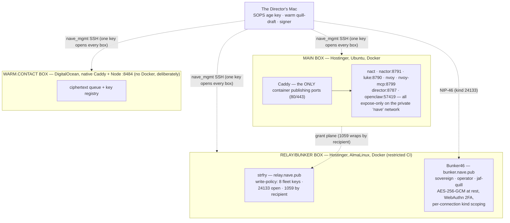

# 05 · Infrastructure (Nfra) & Operations

*Sources: `docs/NOPS.md` · `deploy/ops/{PLAN.md,ssh-standard.md,README.md}` ·
`deploy/{relay,bunker}/README.md` · `deploy/caddy/Caddyfile` ·
`deploy/{MIGRATION,OPENCLAW-CUTOVER}.md` · `docs/SIDE-QUESTS.md` ·
`.github/workflows/`. Boxes are named by role only — IPs live in Bitwarden.*

## 1 · The fleet

**Domain map** (main-box Caddyfile): `nave.pub`+`www` (hub) · static vhosts
`nvelope · nontact · notegate · ntrigue · nvoy · ngage · nherit · nscope ·
noir` · `director` → :8787 · `nact` (`/api` → nactor:8791; the one vhost that
can't use the shared cache snippet — it carries its own guard) · `luke` ·
gated `cockpit`/`console` → luke gate → openclaw. Relay box's own Caddy serves
`relay` and `bunker`. `sites.sh` fast-forwards each app repo into
`deploy/sites/<name>`, mounted read-only at `/srv/apps`.

## 2 · The relay (strfry) — owning the grant fabric's transport

The point: grants, entitlement reads, endpoint adverts, and profiles stop
depending on public relays, and the metadata (who grants what to whom, when)
stays off third-party infra. Write policy (`write-policy.py` +
`allowlist.json`, offline-tested): fleet-authors all kinds · kind 24133 from
anyone (NIP-46 transport is E2E-encrypted; ephemeral client keys can't be
pre-listed) · **kind 1059 admitted by recipient `p`-tag** (wraps have
ephemeral authors by design — nave.pub#37, the fix that let the sovereign flow
ride the sovereign relay) · else reject. Partners deliberately off the list.
Retention: replaceables keep latest; 24133/ephemeral self-expire.

## 3 · The bunker (Bunker46)

Always-on NIP-46 signer holding the **sovereign**, **operator**, and
**jaf-quill** keys (see [02](02-identities-and-signing.md) §2 — the original
"delegated-operator-only" plan evolved; the registry is current). Mitigations
for "always-on signer = always-on attack surface": per-connection tokens,
**event-kind scoping** (jaf-quill: 30440/1059/13 only — cannot sign a post),
approval prompts/2FA, rate limits, 3-relay signing transport (own + two public
— no single-relay lockout). `.env` `ENCRYPTION_KEY` is generated once and must
stay stable; it and the key store are the backup-critical pair.

## 4 · CI ops channels (the interim control plane — "proto-Nops")

Same shape as Nops (verb menu, restricted key, versioned scripts) over the
wrong transport (GitHub Actions + SSH) — by explicit naming decision, **Nops**
is reserved for the nostr-native version.

| Workflow | Channel | Power |
|---|---|---|
| `fleet-ops.yml` | main + warm boxes | full CI key |
| `relay-ops.yml` | relay/bunker box | **restricted**: forced-command allowlist (`ci-ops-allow.sh`) — fixed verbs, never a shell, cannot read the sovereign `.env`; a `harden` verb was deliberately declined (mutating the sovereign box stays human-in-the-loop) |
| `ops.yml` | main box | curated tasks + `task: custom` (input name is `command`); destructive actions live only behind `custom`, "never one accidental click away" |
| `deploy.yml` / `verify.yml` / `smoke.yml` / `probe.yml` | main | deploy + health harness + external read-only probe |
| `brain-cron.yml` / `scribe-cron.yml` | main | Luke's twice-daily brain; the thrice-daily bunker-mode scribe (UTC times — this box's cron ignores `CRON_TZ`) |

Ops-script property worth knowing: `deploy/ops/**` is in the deploy's
`paths-ignore` and Ops does a fast pull, so **editing an ops script needs no
deploy** — commit and run. Channel reliability: the runner's SSH to a healthy
main box intermittently times out — re-dispatch or fall back to direct
`nave_mgmt`; re-verify before treating a red deploy as an outage.

## 5 · Secrets custody (operational view)

| Secret | Home | Backup |
|---|---|---|
| Fleet role nsecs | SOPS `deploy/secrets/nave.enc.env` (age) | Bitwarden notes per identity |
| SOPS age key | Mac `~/.config/sops/age/keys.txt` | Bitwarden (unlocks everything — vault-critical) |
| Bunker `.env` (`ENCRYPTION_KEY`) + key store | relay/bunker box | Bitwarden + `.env.bak` |
| `nave_mgmt` SSH key | Mac | Bitwarden; per-box root passwords = console break-glass |
| CI keys (`github-deploy`, `nave_ci_relay` restricted, `nave_ci_warm`) | GitHub Actions secrets **in nave.pub** (per-repo!) | noted in registry |
| jaf-quill nsec | Bunker46 | Bitwarden escrow; Mac Keychain copy retiring |

## 6 · Standing rules (each paid for by an incident — `docs/SIDE-QUESTS.md`)

- **firewalld is BANNED on Docker hosts** — it flushed Docker's chains and took
  the bunker down (2026-07-20). On-box `firewall.sh` (nftables +
  DOCKER-USER seal) is primary; provider edge is belt-and-suspenders.
- **Never stack rebase-merges; verify the TREE, not the PR badge** — the
  stacked-rebase cascade silently dropped P3–P6 once.
- **Never filter `git push` output** — piped-away rejections, three times.
- **A file must ship everywhere its importer ships** — grep the Dockerfile AND
  workflow mounts (the missing-COPY crash-loop, twice).
- **HTML + importmap + modules move as one versioned unit; no CDN in a sign-in
  path** — the stale-cache double incident (AD-11 corollaries).
- **A control plane never invents state** — Nact's fabricated demo queue is
  gone; disconnected means empty (nact#27).
- **Guards are patterns, not names** (`*.nave.env*`, `*.npub.txt`) — a sealed
  env slipped past a name-based ignore once; so did a key file named `y`.
- **Actions secrets are per-repo** — set them where the workflow runs.
- **Voice sources are evidence, never inference, never AI output** (AD-9).
- New box = `newbox.sh` → firewall → prove key login → `rekey.sh --lock`.
  New agent = mint → allowlist → SOPS → Bitwarden → registry row.
  Break-glass = provider console, root password in Bitwarden.

## 7 · Runbooks

- `deploy/MIGRATION.md` — the noir→nave.pub platform flip: both trees share
  compose project `deploy`, so the certs volume carries over; `down` without
  `-v` is load-bearing; validate the Caddyfile in a throwaway container first.
- `deploy/OPENCLAW-CUTOVER.md` — managed → self-hosted OpenClaw: no published
  port, trusted-proxy mode, Caddy asserts identity after the nostr gate (no
  token); `compose stop` before every repair (the migration lock); the sqlite
  is a rebuildable index, the workspace markdown is the memory.
- `deploy/ops/PLAN.md` — the living fleet runbook + the sequenced roadmap.
