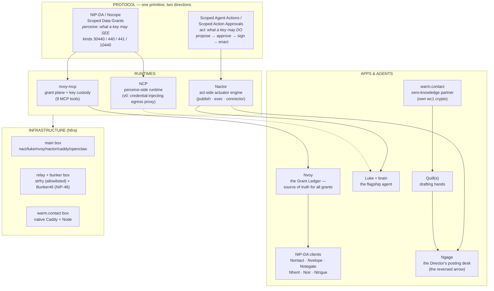

# Nave — The Architecture, End to End

*Compiled 2026-07-25 from a full read of the estate: `nave.pub`, `nact`, `nvoy`,
`ngage`, `luke`, `warm.contact`, and `nostr-scoped-data-grants`. This set is the
map you hand someone (including future you) who has lost the plot. Every claim
traces to a source doc, and [07-doc-drift.md](07-doc-drift.md) lists the places
where existing docs contradict each other.*

**The one-sentence thesis** (INVENTORY.md): *scoped autonomy* — an agent bounded
on both what it may **see** and what it may **do**, with your nostr signature as
the only root of authority, and revocation-by-key-rotation throughout.

**The creed** (JOURNEY.md): *the signature is the authorization; the rotation is
the revocation.*

---

## The whole estate on one screen

The vertical story: **one protocol** (grants for seeing, approvals for doing) →
**three runtimes** that dereference it → **apps and agents** that are pure
clients of it → **three boxes** that host it. Authority never lives in a server,
an ACL, or a token — always in a signed, revocable grant addressed to a key.

## The documents

| Doc | What it covers | Read it when |
|---|---|---|
| [01-protocol.md](01-protocol.md) | NIP-DA from the wire up: kinds, encryption, revocation-as-rotation, the P-series hardening, the v2 attenuation track, the act-side handshake | You need the protocol truth |
| [02-identities-and-signing.md](02-identities-and-signing.md) | Every key in the estate: the roster, custody classes, the key-hierarchy diagram, and the **who-signs-what matrix** | "Which key signs this, and where does it live?" |
| [03-delegated-actions.md](03-delegated-actions.md) | **The act side in full** — Scoped Agent Actions, the two approval paths (AD-10), the actuator contract, the action-grant schema, the threat model, and the July 22–25 work: Ngage, the pen rule, and Quill's bunker custody | You want the recent delegated-actions story |
| [04-apps-and-runtimes.md](04-apps-and-runtimes.md) | The app family, Nactor's internals, NCP, the Nvoy MCP surface, Luke's drafting loop, warm.contact/Quill | "What is each piece and how do they talk?" |
| [05-infrastructure.md](05-infrastructure.md) | The three boxes, the relay's write policy, the bunker, CI ops channels, secrets custody, deploy runbooks | Operating the estate |
| [06-glossary.md](06-glossary.md) | Every N-name, every agent, every term of art — one line each | You've forgotten what a word means |
| [07-doc-drift.md](07-doc-drift.md) | Known contradictions and stale statements across the doc set, dated | Before trusting any single older doc |

**Reading order for re-orientation:** 06 (glossary) → this page → 02 (signing)
→ 03 (delegated actions) → then 01/04/05 as needed. The glossary first is not a
joke; the naming is the steepest part of the ramp.

## The five sentences that organize everything

1. **Data access is a grant**: encrypt under a random scope key, gift-wrap the
   key to a grantee, revoke by rotating the key (NIP-DA; [01](01-protocol.md)).
2. **Action is a proposal**: an agent may only *propose*; a human approves the
   exact bytes; the authorized key signs; the artifact can carry public proof of
   the approval ([03](03-delegated-actions.md)).
3. **Approval happens where the signing key lives** (AD-10): box-custodied keys
   → Nactor → Telegram/web tap; the Director's own posts → Ngage, drafts
   gift-wrapped to his npub, signed in his own hand — "only the Director can
   approve" is enforced by encryption, not policy.
4. **Credentials are granted to identities, never held by the broker**: the
   runtime that uses credentials cannot receive them (post-M7, the Nactor's own
   key is custodied by nvoy-mcp; the runtime env holds no nsec).
5. **The relay, the bunker, and the boxes are replaceable**; the identities and
   grants are not. Moving a box is a republish, never a reconfigure (AD-2).

## Status snapshot (2026-07-25)

- Protocol: NIP-DA spec P1–P6 hardened (2026-07-22), PR nostr-protocol/nips#2411
  open; JS + Go reference implementations interop-verified (9 live scenarios).
- Act side: Ngage live (first sovereign post signed 2026-07-22); pen-verified
  desk shipped 2026-07-24; Scoped Agent Actions design + research complete
  (2026-07-23), scope-schema freeze pending Director review.
- Custody: James's Quill resolved to **one key, sole custody Bunker46**
  (2026-07-24); box scribe retired to break-glass, bunker-mode branch is the
  sanctioned always-on drafter, thrice-daily cadence installed.
- Credential migration M1–M7: **closed** (2026-07-21).
